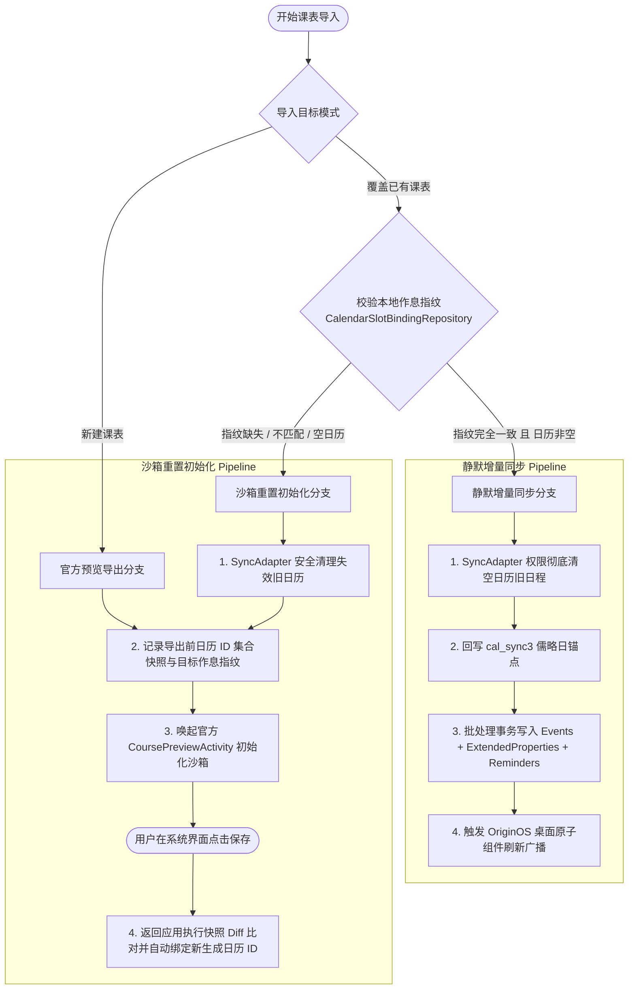
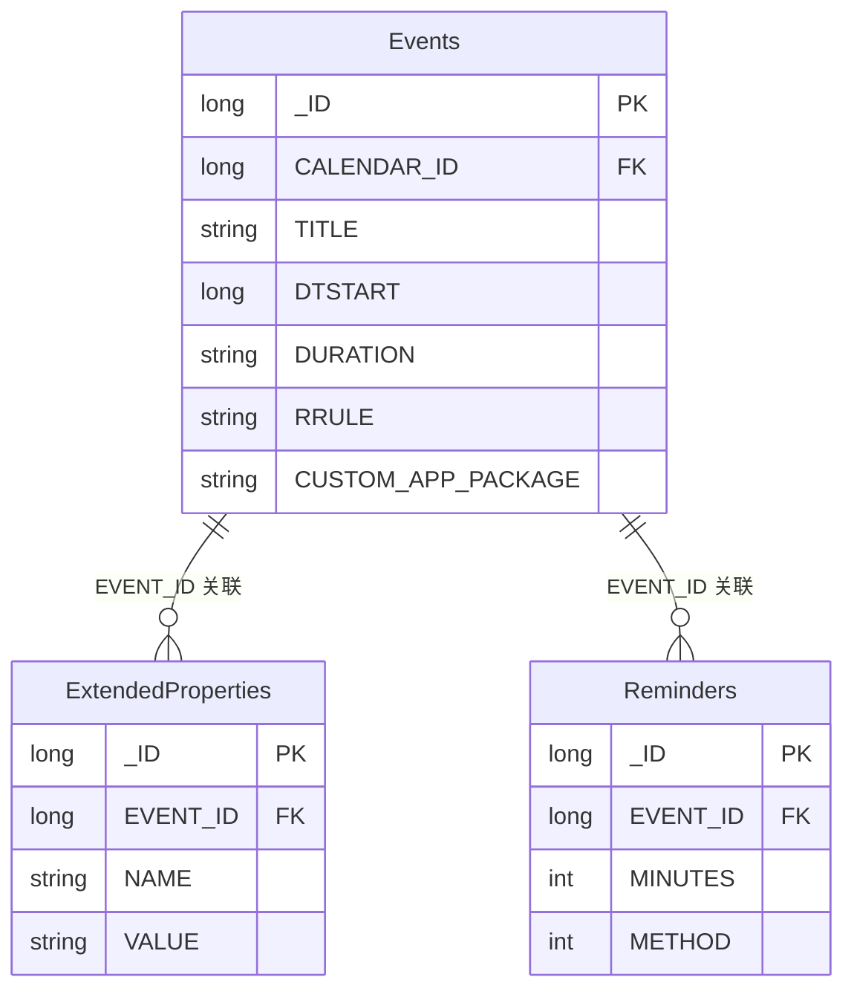

# VivoSync 技术架构与核心协议开发文档

---

## 1. 概述与设计目标

VivoSync 是一款专为 vivo / iQOO 设备 OriginOS 原生日历设计的课程表同步中间件与教务数据整合引擎。系统旨在解决 OriginOS 下日历内置课程表功能导入功能不完善、无法直接导入和同步高校教务系统等痛点。

系统严格遵循 RFC 5545 iCalendar 周期性循环事件规范，基于 Android CalendarProvider 标准接口与 OriginOS 日历交互协议，采用“静默增量写入 + 官方预览重置”的双轨混合同步架构，实现课程数据的高效持久化与系统桌面小组件联动。

---

## 2. 系统架构与分层设计

系统整体采用现代 Android 推荐架构，遵循 **MVI (Model-View-Intent)** 单向数据流与清晰的分层职责隔离原则。整体架构划分为五大核心层次：

```mermaid
graph TB
    subgraph UI_Layer [UI / 表现层 (Jetpack Compose)]
        HomeScreen[HomeScreen 主界面]
        SyncDialog[CoursePreviewSyncDialog 同步调度弹窗]
        ShiguangScreen[ShiguangImportScreen 拾光导入]
        SettingsScreen[SettingsScreen 系统配置]
    end

    subgraph ViewModel_Layer [ViewModel / 调度与状态层]
        VivoSyncVM[VivoSyncViewModel 统一状态机]
        UIState[VivoSyncUiState 单向数据流状态]
    end

    subgraph Repository_Layer [Data / 数据仓储层]
        SlotRepo[CalendarSlotBindingRepository 作息指纹仓储]
        ScheduleRepo[ScheduleRepository 课表数据仓储]
        AdapterRepo[ShiguangAdapterRepository 适配脚本仓储]
        ThemeRepo[ThemePreferencesRepository 主题配置]
    end

    subgraph Engine_Layer [Engine / 核心同步与规则引擎]
        ProviderClient[VivoNativeProviderSyncClient Provider 事务客户端]
        PreviewExporter[VivoCoursePreviewExporter 官方预览导出器]
        CalendarManager[VivoCourseCalendarManager 日历账户与小组件管理器]
        DateAligner[VivoDateAligner 学期日期对齐引擎]
        DateParser[VivoDateParser 智能容错与儒略日解析器]
        EnvGuard[VivoEnvironmentGuard 环境与兼容性守卫]
    end

    subgraph System_Layer [OriginOS 系统底层]
        CalendarProvider[(Android CalendarProvider / provider.calendar)]
        VivoSandbox[(vivo 私有沙箱 MMKV: course_setting_<id>)]
        OriginOSWidgets[OriginOS 桌面原子小组件]
    end

    UI_Layer -->|Intent / Event| ViewModel_Layer
    ViewModel_Layer -->|StateFlow| UI_Layer
    ViewModel_Layer -->|Repository 调用| Repository_Layer
    ViewModel_Layer -->|调度编排| Engine_Layer
    Repository_Layer -->|Jetpack DataStore| Repository_Layer
    Engine_Layer -->|ContentResolver 批量事务| CalendarProvider
    Engine_Layer -->|DeepLink / Intent 协议| VivoSandbox
    CalendarManager -->|广播通知| OriginOSWidgets
```

### 2.1 表现层 (UI Layer)
- **技术栈**：Jetpack Compose、Material 3、Modern Android UI 组件。
- **职责**：
  - 纯函数式 UI 渲染，只对 `VivoSyncUiState` 产生响应，无任何私有持久化状态；
  - 承载教务解析 WebView（`ShiguangWebBridge`）的注入与交互；
  - 负责导入向导、课表切换、原子色彩选择与冲突调度的可视化呈现。

### 2.2 状态与调度层 (ViewModel Layer)
- **核心组件**：`VivoSyncViewModel`
- **职责**：
  - 集中维护全局唯一状态 `VivoSyncUiState`（包含日历列表、导入课程暂存、作息配置、进度加载状态及错误通知）；
  - 实现导入模式路由：依据目标日历 ID 与本地作息指纹，自动决策进入“静默增量同步”或“官方沙箱重置初始化”分支；
  - 监控并比对官方预览导出的返回快照（`checkPendingExportResult`），确保跨进程数据状态的收敛一致性。

### 2.3 数据仓储层 (Data / Repository Layer)
- **核心组件**：`CalendarSlotBindingRepository`、`ScheduleRepository`
- **职责**：
  - **作息指纹持久化**：基于 Jetpack Preferences DataStore 记录系统日历 ID 与作息时间表 SHA-256 哈希值的映射关系；
  - **导出快照比对**：在唤起系统官方预览页面前后对全局日历集合进行差分（Diff）追踪，自动识别用户在官方界面新建或放弃保存的日历实例；
  - **解耦隔离**：阻断 UI 表现层与底层存储及系统数据库的直接耦合。

### 2.4 引擎与协议层 (Engine Layer)
- **核心组件**：
  - `VivoNativeProviderSyncClient`：承载 `CalendarContract` 的批量事务插入与历史数据幂等清理；依据 RFC 5545 生成 RRULE 与 DURATION 并维护扩展属性；
  - `VivoCoursePreviewExporter`：遵循 vivo 原生 JSON 序列化规范，构建 DeepLink Intent 并唤起 `com.bbk.calendar.CoursePreviewActivity`；
  - `VivoCourseCalendarManager`：管理 `"Course account"` / `"LOCAL"` 专用日历的创建、激活标记（`cal_sync1`）切换、级联删除与桌面原子小组件广播分发；
  - `VivoDateAligner` & `VivoDateParser`：规范化开学周一锚定点，完成儒略日（`cal_sync3`）与标准公历的高精度双向互转；
  - `VivoEnvironmentGuard`：设备特征识别（vivo/iQOO 校验）与系统日历协议兼容性熔断守卫。

---

## 3. 核心技术原理与协议规范

### 3.1 周期性事件模型与 RFC 5545 规范

#### 3.1.1 周期循环规则 (RRULE) 规范
在 `VivoNativeProviderSyncClient` 中，每门课程作为一条循环基础事件持久化至 `Events` 表。系统通过 `buildVivoRrule` 生成符合 RFC 5545 规范的周循环规则串（如 `FREQ=WEEKLY;UNTIL=...;WKST=SU;BYDAY=...;BYWEEKNO=...`）：

- **`FREQ=WEEKLY`**：以自然周为步长进行周期循环。
- **`WKST=SU`**：循环星期的起始基准为周日（Sun），符合底层 `EventRecurrence` 解析器的要求。
- **`BYDAY`**：周内上课日，映射为 `MO`, `TU`, `WE`, `TH`, `FR`, `SA`, `SU`。
- **`BYWEEKNO`**：自然年内的公历周序号集合（1 ~ 53）。系统将学期教学周次转换为对应的自然年周，并支持跨自然年学期的周次衔接。
- **`UNTIL`**：循环截止时间戳，统一设定为基准开学周一顺延学期总周数后的终止时间（格式为 `yyyyMMdd'T'000000`）。

#### 3.1.2 CalendarProvider 字段写入契约
根据 RFC 5545 与 Android CalendarProvider 规范，循环事件的起止时间具有绝对约束：

| 字段名 | 类型 / 规范 | 写入值 / 约束规则 | 技术原理与约束解释 |
| :--- | :--- | :--- | :--- |
| `DTSTART` | Long (UTC Millis) | 第一周上课当天的开始时间戳 | 循环事件的基准锚点时间戳。 |
| `DTEND` | Long | **`null`** | **核心规范**：RFC 5545 规定循环事件不得同时显式声明 `DTEND` 与 `DURATION`，否则导致 CalendarProvider 抛出异常或覆盖循环规则。 |
| `DURATION` | String (ISO 8601) | `P<seconds>S` (例如 `P6000S`) | 显式声明单次日程的持续时长（秒数），用于由系统动态计算各次 `Instances` 的结束时间。 |
| `RRULE` | String | 符合 RFC 5545 的周循环规则串 | 驱动系统底层 `EventRecurrence` 解析周期实例。 |
| `ALL_DAY` | Int | `0` | 非全天事件。 |
| `EVENT_TIMEZONE` | String | `ZoneId.systemDefault().id` | 锁定设备本地时区（如 `"Asia/Shanghai"`）。 |
| `EVENT_COLOR_KEY` | String | `"1"` ~ `"12"` | 对应 vivo 12 种原子配色索引。 |
| `hasAttendeeData`| Int | `1` | 保持与 vivo 原生写表一致性。 |
| `CUSTOM_APP_PACKAGE` | String | 本应用 PackageName | 标识写入来源，用于增量运维与权限审计。 |

---

### 3.2 vivo 原生日历私有沙箱机制与双轨混合同步策略

#### 3.2.1 MMKV 沙箱约束
vivo OriginOS 日历系统对课程表的管理采用了“数据库事件”与“私有配置沙箱”分离的架构：
- **公共事件数据**：存储于系统 `CalendarProvider`（`com.android.providers.calendar`）的数据库中；
- **排版作息配置**：每个课程表专属日历在创建时，会在 vivo 日历进程的私有目录中生成 MMKV 二进制持久化文件：
  ```
  /data/user_de/0/com.bbk.calendar/files/mmkv/course_setting_<calendarId>
  ```
- **安全边界限制**：由于 Android 应用沙箱隔离，第三方应用无法在无 Root 权限的情况下读取或修改 `com.bbk.calendar` 的内部 MMKV 数据。

#### 3.2.2 双轨混合同步决策矩阵
若在未初始化 MMKV 配置的日历中仅写入 `Events`，vivo 日历界面的网格排版将无法识别节次时间与总节数，从而引发网格错位。VivoSync 实现了 **双轨混合同步算法**：



#### 3.2.3 决策分支详解

##### 1. 静默增量同步 (Silent Sync)
- **准入条件**：
  1. 用户选择同步到系统已有课表；
  2. `CalendarSlotBindingRepository` 中记录的作息 SHA-256 指纹与当前待导入数据的作息指纹完全一致；
  3. 目标日历中已存在历史日程（确认已在 vivo 系统内成功初始化过沙箱）。
- **执行过程**：
  - 调用 `VivoNativeProviderSyncClient`，通过 `ContentResolver.applyBatch` 以 `CALLER_IS_SYNCADAPTER=true` 的特权模式在后台毫秒级执行；
  - 零界面跳转、零弹窗打扰，直接更新系统数据库并广播刷新小组件。

##### 2. 沙箱重置初始化 (Sandbox Re-initialization & Export)
- **触发场景**：
  - 用户主动创建新课表；
  - 同步到已有课表，但课程作息发生变更（如夏季作息调整、节次增减），此时原日历私有 MMKV 中的作息设定已失效；
  - 目标日历为无日程的空壳日历。
- **系统沙箱重建机制**：
  - **官方预览命名限制**：vivo 官方 `CoursePreviewActivity` 作为系统级独立组件，**不支持外部应用携带或指定自定义课表名称**（外部传入的名称参数会被系统忽略，由 vivo 日历按系统默认规则命名）。
  - **执行流程与生命周期收敛**：
    1. 若针对已有课表进行作息变更同步，由于无法直接修改系统私有 MMKV 沙箱，系统在唤起官方预览前先通过 SyncAdapter 特权通道安全物理删除失效的旧日历（`deleteCalendar`），避免系统日历内残留失效课表与脏数据；
    2. 记录当前系统已有日历 ID 集合快照，将目标作息指纹压入暂存区；
    3. 唤起系统 `CoursePreviewActivity`，引导用户在系统界面保存，由 vivo 官方程序创建带有新作息沙箱的新日历实例；
    4. 用户返回 VivoSync 时，自动触发差分比对（`checkPendingExportResult`），检测新生成的日历 ID 并完成新作息指纹的重新绑定。

---

### 3.3 扩展属性契约与节次映射 (ExtendedProperties)

vivo 原生日历依靠 `CalendarContract.ExtendedProperties` 数据表建立日程与课表网格节次的强绑定关系。每个课程事件在插入 `Events` 表后，必须在同一事务中通过 `BackReference` 写入三项扩展元数据：



#### 扩展字段规范表

| 扩展属性名称 (`NAME`) | 属性取值 (`VALUE`) | 数据类型 | 作用与系统表现 |
| :--- | :--- | :--- | :--- |
| `lesson_start` | `"1"` ~ `"14"` | String (Int) | 标记该课程在网格视图中的**起始节次**序号。 |
| `lesson_end` | `"1"` ~ `"14"` | String (Int) | 标记该课程在网格视图中的**结束节次**序号。 |
| `reminder_alert_type` | `"0"` | String | **vivo 专有告警通道标识**。`"0"` 代表遵循课程表专有静音/振动提醒策略。 |

---

### 3.4 官方预览 JSON 通信协议规范

通过 DeepLink 唤起 vivo 官方导入界面时，Intent Action 声明为：
```
vivo.intent.action.calendar.COURSE_PREVIEW
```
载荷数据通过 `Intent.putExtra("course_data", jsonString)` 传递。核心 JSON Schema 定义如下：

```json
{
  "result": 0,
  "message": "success",
  "courseName": "2026年春季学期",
  "tableName": "2026年春季学期",
  "timeSetting": {
    "duration": 45,
    "breaks": 10,
    "times": [
      {
        "timeSlot": 1,
        "selection": 1,
        "beginTime": 480,
        "endTime": 525
      },
      {
        "timeSlot": 1,
        "selection": 2,
        "beginTime": 535,
        "endTime": 580
      }
    ]
  },
  "classes": [
    {
      "className": "高等数学",
      "teacher": "张教授",
      "room": "教三 101",
      "dayOfWeek": 1,
      "start": 1,
      "end": 2,
      "weeks": [1, 2, 3, 4, 5, 6, 7, 8, 9, 10, 11, 12, 13, 14, 15, 16],
      "singleOrBiWeekly": 0
    }
  ]
}
```

#### 协议字段映射表

| 字段路径 | 类型 | 语义描述与单位 |
| :--- | :--- | :--- |
| `courseName` / `tableName` | String | 课表名称字段。注：vivo 官方预览页面不支持外部透传自定义课表名称，传入值会被系统忽略，由系统按内置规则命名。 |
| `timeSetting.duration` | Int | 单节标准课程时长（分钟）。 |
| `timeSetting.breaks` | Int | 默认小课间休息时长（分钟）。 |
| `timeSetting.times[].timeSlot` | Int | 时段分类：`1` = 上午，`2` = 下午，`3` = 晚上。 |
| `timeSetting.times[].selection` | Int | 节次序号（从 1 开始递增）。 |
| `timeSetting.times[].beginTime` | Int | **当日绝对分钟数**（例如 08:00 为 480）。 |
| `timeSetting.times[].endTime` | Int | **当日绝对分钟数**（例如 08:45 为 525）。 |
| `classes[].dayOfWeek` | Int | 星期几（1 = 周一，...，7 = 周日）。 |
| `classes[].start` / `end` | Int | 课程所占用的节次起止序号。 |
| `classes[].weeks` | Array\<Int\> | 上课周次数组（例如 `[1, 2, 3, 4, 5]`）。 |
| `classes[].singleOrBiWeekly`| Int | 单双周标记：`0` = 全部，`1` = 单周，`2` = 双周。 |

---

### 3.5 OriginOS 系统集成与小组件通知协议

#### 3.5.1 日历表专有属性契约
在 `CalendarContract.Calendars` 系统表中，vivo OriginOS 定义了专有的同步与配置字段：

| 数据库列名 | 类型 | 规范赋值 | 系统作用与联动原理 |
| :--- | :--- | :--- | :--- |
| `ACCOUNT_NAME` | String | `"Course account"` | 标识该日历属于 vivo 原生课程表体系。 |
| `ACCOUNT_TYPE` | String | `"LOCAL"` | 本地账户类型。 |
| `cal_sync1` | String | `"1"` 或 `"0"` | **激活状态标记**。`"1"` 代表当前为 OriginOS 桌面选中的活跃主课表。切换活跃课表时，必须通过排他性事务将其他日历的 `cal_sync1` 置为 `"0"`。 |
| `cal_sync3` | Int | 儒略日数值 (Julian Day) | **学期开学第 1 周周一的儒略日**。OriginOS 桌面小组件据此计算“当前是第几周”。 |
| `cal_sync10` | Long | 系统毫秒时间戳 | 标记课表元数据的最后更新时间戳。 |

#### 3.5.2 儒略日 (Julian Day) 计算规范
开学周一的绝对日期必须准确换算为标准儒略日（Julian Day）并写入 `cal_sync3`，以确保 OriginOS 日历及其桌面组件的周次计算精准对齐。

计算基于 `java.time.temporal.JulianFields`：
```kotlin
val julianDay = alignedStartDate.getLong(JulianFields.JULIAN_DAY).toInt()
```
*例如：2026 年 3 月 2 日对应儒略日数值为 `2461102`。*

#### 3.5.3 跨进程原子小组件广播链
在批量事务提交后，系统底层仅完成了数据库持久化。为使 OriginOS Launcher 及桌面的“课程小组件”、“日程原子卡片”即时重绘，必须依次分发以下广播通知链：

```kotlin
// 1. 触发系统日历提醒调度器刷新
context.sendBroadcast(Intent(CalendarContract.ACTION_EVENT_REMINDER))

// 2. 触发系统日历 Provider 变更总线
context.sendBroadcast(
    Intent("android.intent.action.PROVIDER_CHANGED").setData(CalendarContract.CONTENT_URI)
)

// 3. 唤醒 vivo 原生课表桌面组件专属接收器
context.sendBroadcast(
    Intent("com.bbk.calendar.action.UPDATE_WIDGET").setPackage("com.bbk.calendar")
)

// 4. 触发时钟与日期总线被动重算（促使 Widget 重绘当前周次）
context.sendBroadcast(Intent(Intent.ACTION_TIME_CHANGED))
context.sendBroadcast(Intent(Intent.ACTION_DATE_CHANGED))
```

---

## 4. 源码目录与关键类映射索引

```
app/src/main/java/com/app/vivosync/
├── data/
│   ├── CalendarSlotBindingRepository.kt     # 作息 SHA-256 指纹持久化与导出快照跟踪
│   ├── ScheduleRepository.kt                # 多课表本地持久化仓储
│   └── ThemePreferencesRepository.kt        # 主题与外观偏好设置
├── engine/
│   ├── VivoNativeProviderSyncClient.kt      # CalendarProvider 静默写入引擎与 RRULE 计算
│   ├── VivoCourseCalendarManager.kt         # 日历账户生命周期、小组件刷新广播
│   ├── VivoCoursePreviewExporter.kt         # 官方 JSON 协议组装与 DeepLink 导出
│   ├── VivoDateAligner.kt                   # 学期周一绝对对齐与节次时间戳推算
│   └── VivoDateParser.kt                    # 教务日期容错解析与儒略日 (cal_sync3) 转换
├── guard/
│   └── VivoEnvironmentGuard.kt             # 设备机型与系统日历协议兼容性检测
├── model/
│   ├── Models.kt                            # 基础领域模型与官方 JSON 协议 DTO
│   └── VivoCourseCalendar.kt                # 系统课表日历展示实体
├── ui/
│   ├── viewmodel/
│   │   └── VivoSyncViewModel.kt             # 核心 MVI 状态机与同步分支调度器
│   └── screens/
│       ├── HomeScreen.kt                    # 主控制台视图
│       └── CoursePreviewSyncDialog.kt       # 同步目标选择与预览交互弹窗
```
